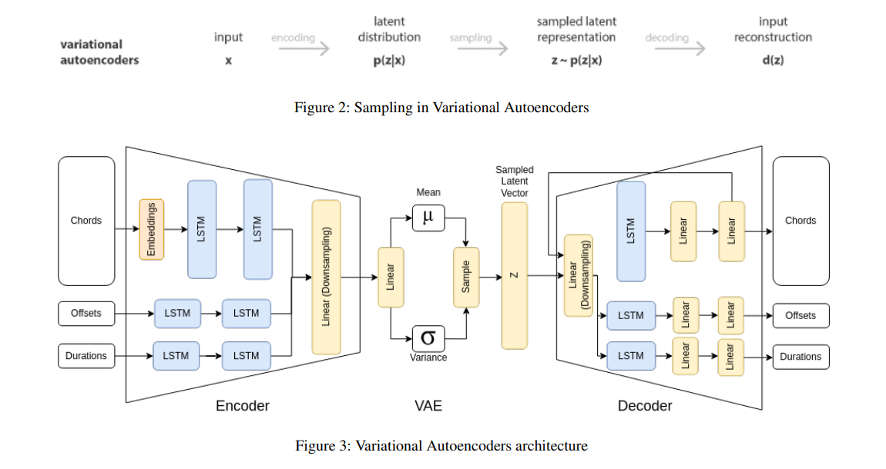

# 8-bit-LoFi-Music-Generator
Using Variational Autoencoders (VAE) and Transformer-XL to generate 8-bit LoFi Music.

## Description
This project presents the development of an 8-bit LoFi music generator using deep learning techniques, specifically LSTM(short-term memory) and VAE(variational autoencoder) models. By training the model on the LoFi MIDI dataset andfine-tuning it using the NES Music Database (NesMDB), we aim to create a system capable of automatically generating an endless stream of new and rhythmic LoFi music with mel-low jazz-like beats. The VAE model is used to capture the underlying distribution of the LoFi music, while LSTM is employed to generate coherent and melodic sequences. To ensure the fidelity of the generated music, KL divergence is employed as a metric to measure the similarity between the generated and original music samples. The proposed system holds potential for enhancing YouTube live streams, offering a continuous stream of distinctive and soothing LoFi music.


## Model Architecture


## Running the code

```sh
python3 train.py
```
Train the VAE model for 500 epochs using a batch size of 32 and a chord length of 16. These constants can be modified by changing values in `./models/constant.py`. It calculates losses between the input notes, offsets, and durations during training. It also calculates the Kullback-Leibler (KL) divergence, which measures the similarity between two distributions, to optimize generative results.

## Generating new samples
```sh
python3 generate.py
```
Generates a random list of floats representing the mean-variance vector. Extract the latent representation of the sample using the mean-variance vector. Runs the decoder on the latent sample to generate chord embeddings, chord predictions, offset predictions, and duration predictions. Uses the Music21 library to generate MIDI note elements corresponding to the predictions generated by the decoder, configuring each note using the predicted chord, offset, and duration. Stitch together all the generated elements to create a single MIDI sample file, which can be easily converted to an MP3 file for listening to the generated music.
